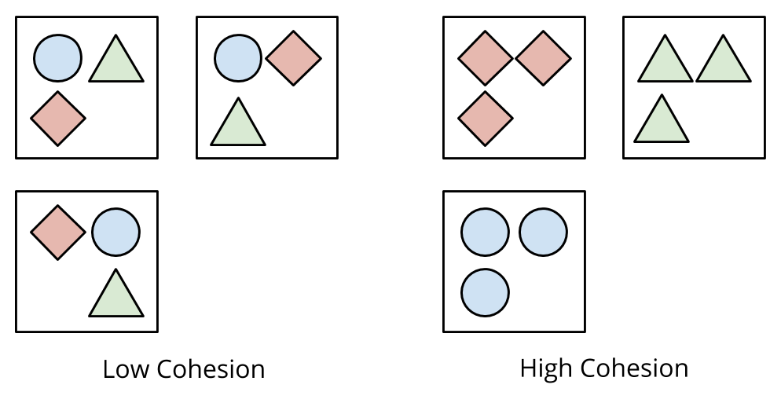
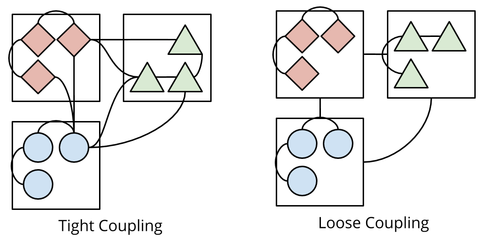

class: middle

# Highly Cohesive,<br />Loosely Coupled<br />\(& Very Awesome\)

#### A domain-driven approach to beautiful systems

---

class: middle

## Let's imagine tonight

We work at a hot new startup: Delorean. The Uber for time-travel!

## 💁⏳🚖🙋

---

class: middle

## OMG it's making so much money!

🔥 We're releasing features right and left! 💵

---

class: middle

## But the code is a mess!

As systems grow, they naturally fall into disarray...

---

## The evolution of a feature

#### Feature: As a passenger, I want to hail a Delorean

* So I can travel in time!

---

class: middle background-color-code

```ruby
class TripsController
  def create
    passenger = Passenger.find(params[:passenger_id])
    driver = Driver.where(
      available: true,
      longitude: params[:longitude],
      latitude: params[:latitude]
    ).first
    driver.send_to!(passenger)
  end
end
```

---

## The evolution of a feature

#### Feature: As a passenger, I want to hail a Delorean

* So I can travel in time!
* ...and my credit card will be charged

---

class: middle background-color-code

```ruby
class TripsController
  def create
    passenger = Passenger.find(params[:passenger_id])
    driver = Driver.where(
      available: true,
      longitude: params[:longitude],
      latitude: params[:latitude]
    ).first
    BraintreeService.charge(passenger)
    driver.send_to!(passenger)
  end
end
```

---

## The evolution of a feature

#### Feature: As a passenger, I want to hail a Delorean

* So I can travel in time!
* ...and my credit card will be charged
* ...and the system should log the event to Google Analytics
---

class: middle background-color-code

```ruby
class TripsController
  def create
    passenger = Passenger.find(params[:passenger_id])
    driver = Driver.where(
      available: true,
      longitude: params[:longitude],
      latitude: params[:latitude]
    ).first
    BraintreeService.charge(passenger)
    AnalyticsService.log_ride_created!
    driver.send_to!(passenger)
  end
end
```

---

## The evolution of a feature

#### Feature: As a passenger, I want to hail a Delorean

* So I can travel in time!
* ...and my credit card will be charged
* ...and the system should log the event to Google Analytics
* ...and we should totally also do food delivery

---

class: middle background-color-code

```ruby
class TripsController
  def create
    passenger = Passenger.find(params[:passenger_id])
    is_food = params[:ride_type] == 'food'
    driver = Driver.where(
      can_food_delivery: is_food,
      # ...
    ).first
    restaurant = Restaurant.find_by(meal_type: params[:meal_type])
    BraintreeService.charge(passenger)
    AnalyticsService.log_ride_created!
    driver.itinerary.add(restaurant)
    driver.itinerary.add(passenger)
  end
end
```

---

## Code clutter in Rails

As the monolith grows, feature code is scattered across the app.

```
app/
  controllers/trips_controller.rb
  models/trip.rb
  helpers/trip_helper.rb
  services/calculate_trip_cost.rb
```

---

## Code clutter in Rails

As the monolith grows, feature code is scattered across the app.

```
app/
  controllers/restaurants_controller.rb
  models/restaurant.rb
  models/meal.rb
  helpers/restaurant_helper.rb
  services/calculate_meal_cost.rb
```

---

## Code clutter in Rails

As the monolith grows, feature code is scattered across the app.

```
app/
  controllers/puppy_deliveries_controller.rb
  models/puppy_delivery.rb
  models/animal_shelter.rb
```

---

class: middle

## So here we are...

* The code is tangled & difficult to change
* Regressions are common
* Features take forever to build & release

---

class: middle center

## 😭

---

class: middle center

## Hi, I'm Andrew

Friendly neighborhood programmer at Carbon Five

---

class: middle center background-color-code


---

class: middle center

### Beautiful systems

---

class: middle center

### Beautiful systems are *highly cohesive*

---

class: middle center

### Beautiful systems are *loosely coupled*

---

class: middle

## Highly cohesive

Elements of a module are strongly related to each other

Near each other, are easily accessible.

---

class: middle center background-image-contain



---

class: middle

## Loosely coupled

Modules minimize their dependencies so that they are easily modifiable

--

Can evolve independently of other modules in the system

???

"The more that we must know of module B in order to understand module A, the more closely connected A is to B"

---

class: middle center background-image-contain



---

class: middle

## Introducing Domain-Driven Design

DDD is both a set of high-level design activities and specific software patterns

???

First came out as a book in 2003: Domain Driven Design by Eric Evans.

It can be very confusing as it's got a lot of concepts and
enterprise-speak.

---

class: middle

### It is *not* a (coding) framework

--
### It is *not* technology-specific

--
### It is *not* prescriptive

---

class: middle

### It maps the software to the business

--
### It values precise language

--
### It values conversations

---

class: middle

## Our goals tonight

✏️ Learn insights to **draw boundaries** in our code!

--

👓 **Visualize our system** from a domain perspective.

--

🛠 Do a little bit of **refactoring**.

???

We'll learn to see the software from the business domain perspective

Visualization is important: you can't improve what you can't see!

---

class: middle center

## Strategic Design

#### Through an exercise called Context Mapping

???

Everybody say "Strategic Design"

We are going to go through an exercise called Context Mapping.

---

#### Apply It! ⚡️

## Step 1: Visualize Your System

Let's generate an ERD diagram!

I like to generate mine with a gem like [`railroady`](https://github.com/preston/railroady) or
[`rails-erd`](https://github.com/voormedia/rails-erd)

If you have multiple systems, do this for each system.

---

class: middle center background-image-contain background-white

background-image: url(images/erd.png)

---

class: middle center

### Yikes.

---

## Core domain

The **Core Domain** is the thing that your business does that makes it unique.

--

Delorean Core Domain: **Transportation**

---

## Supporting domains

A **Supporting Domain** (or Subdomain) are the areas of the business
that play roles in making the **Core Domain** happen.

--

_Delorean Supporting Domains:_

* **Driver Routing** (route me from X to Y)

--
* **Notifications** (push notifications)

--
* **Financial Transactions** (charge the card)

--
* **Product Analytics** (track business metrics)

--
* **Customer Support** (keep people happy)

---

class: middle

#### Apply It! ⚡️

## Step 2: Draw domains on your diagram

Overlay your domains on top of the ERD diagram

You might discover some domains you never even thought you had!

???

Take out a pen, or whiteboard marker and draw areas of your
system that correspond to certain domains.

You may even see some domains you haven't thought of before!

---


class: middle center background-image-contain background-white

background-image: url(images/erd.png)

---

class: middle center background-image-contain background-white

background-image: url(images/erd-2-domains.jpg)

---

## Bounded Contexts

A **Bounded Context** is:

- Concretely: a software system (like a codebase)
- Linguistically: a delineation in your domain where concepts are "bounded", or contained

???

Remember, this is because we agreed that different domains may have
different concepts, and hence different Ubiqutious Languages.

---

#### Apply It! ⚡️

## Step 3: Overlay your bounded contexts

Next up - with a different color pen or marker, draw lines around system
boundaries / bounded contexts.

--

You may also find other system boundaries like:

* External cloud providers
* Other teams' services or systems

---

class: middle center background-image-contain background-white

background-image: url(images/erd-2-domains.jpg)

---

class: middle center background-image-contain background-white

background-image: url(images/erd-3-bounded-context-simplified.png)

---

class: middle center background-image-contain background-white

background-image: url(images/erd-4-bounded-context-extended.png)

---

## Congrats! You just made a Context Map!

A **Context Map** gives us a place to see the current system as-is (the
problem space), the strategic domains, and their dependencies.

---

## Making sense of the Context Map

We may notice a few things:

--

* One bounded context contains multiple sub-(supporting) domains

--
* One domain is spread out between multiple bounded contexts

???

Note upstream vs downstream dependencies. These are communication bottlenecks.

---

## An important design principle

Each **Domain** should have its own bounded context

--

We just found the areas where code "naturally" fits together, because
they are serving the same business goal.

Increased cohesion!

???

We just found the areas where code "naturally" fits together, because
they are serving the same business goal.

We will find that these entities naturally prefer each other, since
they live in the same organizational unit.

---

#### Apply It! ⚡️

## Break your application into domain modules

Incremental refactoring, using Ruby Modules to lead the way

---

class: middle background-color-code

```ruby
class Trip < ActiveRecord::Base
  belongs_to :vehicle
  belongs_to :passenger
  belongs_to :driver
end

class TripsController < ApplicationController
  # ...
end
```

---

class: middle background-color-code

```ruby
module Ridesharing
  class Trip < ActiveRecord::Base
    belongs_to :vehicle
    belongs_to :passenger
    belongs_to :driver
  end
end

module Ridesharing
  class TripsController < ApplicationController
    # ...
  end
end
```

---

Find references to newly modulized classes and change them.

---

class: middle background-color-code

```ruby
class Invoice
  belongs_to :trip
end
```

---

class: middle background-color-code

```ruby
class Invoice
  belongs_to :trip, class_name: Ridesharing::Trip
end
```

---

## Now smush them together into a domain folder

Vertical decomposition

```
app/domains/ridesharing/trip.rb
app/domains/ridesharing/service_tier.rb
app/domains/ridesharing/vehicle.rb
app/domains/ridesharing/trips_controller.rb
```

---

Placeholder image for files in folders moving to new locations.

---

## Modulizing increases cohesion

Now we've modulized the code and moved everything to logically fit
together, what more can we do?

---

#### (Also: Shared Kernel)

---

## Decrease coupling by introducing aggregate roots

Prevent data access from other domains to things that aren't ARs.

You can have multiple ARs.

---

## Break AR relationships to use ARs

Stop linking things willy-nilly through too many AR relationships.

---

## Provide Adapters and Repositories

How? Through Adapter/Repository pattern.

Or a simple Service that performs an operation in another domain.

---

## Decrease coupling by publishing events for async dependencies

How? By implementing event-driven frameworks like Wisper.

Async domains perform well here!

---

Ship these aggregates around together!

---

Introduce an Adapter between domains when you do calls.

---

## Extra insight

Conway's Law, paraphrased: "Software systems tend to look like the
organizations that produce them"

--

DDD modeling oftentimes reveals domains that follow organizational
layouts.

Your software systems follow organizational optimizations.

--

Thus this is a very natural place to draw a seam!

???

The organization has optimized for communication within itself,
and has likely reduced its dependencies on other organizational units.

---

## Warning: Limitations apply!

Don't try to do this on every project!

--

I've been guilty of overdesigning.

--

Try it out, step by step

--

Back it out if this doesn't "fit"

???

Here's what you can do: spike it out.
See how it feels and fits. Back it out if it doesn't work for you.

---

## Prior Art

* W. P. Stevens ; G. J. Myers ; L. L. Constantine. ["Structured Design"](http://ieeexplore.ieee.org/document/5388187/) - IBM Systems Journal, Vol 13 Issue 2, 1974
* http://www.win.tue.nl/~wstomv/quotes/structured-design.html#6
* https://www.infoq.com/articles/ddd-contextmapping
* http://gorodinski.com/blog/2013/04/29/sub-domains-and-bounded-contexts-in-domain-driven-design-ddd/
