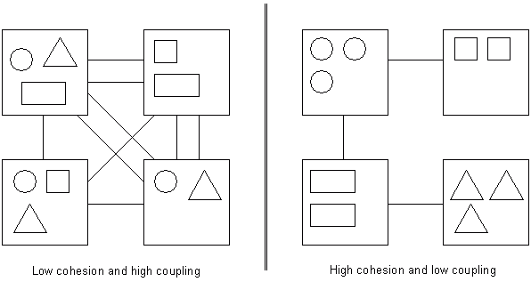

class: middle

# Highly Cohesive,<br />Loosely Coupled<br />\(& Very Awesome\)

#### A domain-driven approach to beautiful systems

---

class: middle

## Let's imagine tonight

We work at a hot new startup: Delorean. The Uber for time-travel!

## 💁⏳🚖🙋

---

class: middle

## OMG it's making so much money!

🔥 We're releasing features right and left! 💵

---

class: middle

## But the code is a mess!

As systems grow, they naturally fall into disarray...

---

class: middle

## Proliferation of code

---

class: middle background-color-code

```ruby
class RidesController
  def create
    passenger = Passenger.find(params[:passenger_id])
    driver = Driver.where(
      available: true,
      longitude: params[:longitude],
      latitude: params[:latitude]
    ).first
    driver.send_to!(passenger)
  end
end
```

---

class: middle background-color-code

```ruby
class RidesController
  def create
    passenger = Passenger.find(params[:passenger_id])
    driver = Driver.where(
      available: true,
      longitude: params[:longitude],
      latitude: params[:latitude]
    ).first
    passenger.charge_credit_card!
    driver.send_to!(passenger)
  end
end
```

---

class: middle background-color-code

```ruby
class RidesController
  def create
    passenger = Passenger.find(params[:passenger_id])
    driver = Driver.where(
      available: true,
      longitude: params[:longitude],
      latitude: params[:latitude]
    ).first
    passenger.charge_credit_card!
    Analytics.log_ride_created!
    driver.send_to!(passenger)
  end
end
```

---

class: middle background-color-code

```ruby
class RidesController
  def create
    passenger = Passenger.find(params[:passenger_id])
    is_food = params[:ride_type] == 'food'
    driver = Driver.where(
      can_food_delivery: is_food,
      # ...
    ).first
    restaurant = Restaurant.find_by(meal_type: params[:meal_type])
    passenger.charge_credit_card!
    Analytics.log_ride_created!
    driver.itinerary.add(restaurant)
    driver.itinerary.add(passenger)
  end
end
```

---

## Code clutter in Rails

As the monolith grows, feature code is scattered across the app.

```
app/
  controllers/rides_controller.rb
  models/ride.rb
  helpers/ride_helper.rb
  services/do_a_ride_thing.rb
```

---

class: middle

## So here we are...

* Features take forever to release
* Regressions are high
* The code is really hard to untangle.

---

## The evolution of a feature

#### Feature: As a passenger, I want to hail a Delorean

* So I can travel in time!

--
* ...and my credit card will be charged

--
* ...and the system should log the event to Google Analytics

--
* ...and sometimes I want food delivery

--
* ...and I want to use our internal Driver Routing system

--
* ...and the Driver should receive a notification

--
* ...and sometimes we do puppy promotions 🐶

---

class: middle center

## 😭

---

class: middle center

## Hi, I'm Andrew

Friendly neighborhood programmer at Carbon Five

---

class: middle center background-color-code


---

class: middle center

### Beautiful systems
---

class: middle center

### Beautiful systems are *highly cohesive*

---

class: middle center

### Beautiful systems are *loosely coupled*

---

class: middle

## Highly cohesive

Modules and their related entities are all organized to live logically
near each other, are easily accessible.

---

class: middle

Placeholder image: low cohesion vs high cohesion

---

class: middle

## Loosely coupled

Modules do not entangle themselves with other concerns in the world.

Possible to evolve one area of the system independently or easily over
the other.

---

class: middle

Placeholder image: low coupling vs high coupling

---

class: middle centered background-image-contain



---

class: middle

## Introducing Domain-Driven Design

DDD is both a set of high-level design practices and specific software patterns

---

class: middle

### It is *not* a (coding) framework

--
### It is *not* technology-specific

--
### It is *not* prescriptive

---

class: middle

## Our goals tonight

✏️ Learn insights to **draw boundaries** in our code!

--

👓 See our system for what it truly is

---

class: middle center

## Strategic Design

---

#### Apply It! ⚡️

## Step 1: Visualize Your System

Let's generate an ERD diagram!

I like to generate mine with a gem like [`railroady`](https://github.com/preston/railroady) or
[`rails-erd`](https://github.com/voormedia/rails-erd)

If you have multiple systems, do this for each system.

---

Placeholder for Railroady UML diagram

---

class: middle center

### Yikes.

---

## Core domain

The **Core Domain** is the thing that your business does that makes it unique.

--

Delorean Core Domain: **Transportation**

---

## Supporting domains

A **Supporting Domain** (or Subdomain) are the areas of the business
that play roles in making the **Core Domain** happen.

--

_Delorean Supporting Domains:_

* **Driver Routing** (route me from X to Y)

--
* **Notifications** (push notifications)

--
* **Financial Transactions** (charge the card)

--
* **Product Analytics** (track business metrics)

--
* **Customer Support** (keep people happy)

---

class: middle

#### Apply It! ⚡️

## Step 2: Draw domains on your diagram

Overlay your domains on top of the ERD diagram

You might discover some domains you never even thought you had!

???

Take out a pen, or whiteboard marker and draw areas of your
system that correspond to certain domains.

You may even see some domains you haven't thought of before!

---

Placeholder image of ERD diagram + domain overlays

---

## Bounded Contexts

A **Bounded Context** is:

- Concretely: a software system (like a codebase)
- Linguistically: a delineation in your domain where concepts are "bounded", or contained

???

Remember, this is because we agreed that different domains may have
different concepts, and hence different Ubiqutious Languages.

---

#### Apply It! ⚡️

## Step 3: Overlay your bounded contexts

Next up - with a different color pen or marker, draw lines around system
boundaries / bounded contexts.

--

You may also find other system boundaries like:

* External cloud providers
* Other teams' services or systems

---

Placeholder image for bounded context diagram

---

#### Apply It! ⚡️

## Step 4: Add directional dependencies

Now - between each boundary, we will want to make clear what things need
other things. These things allow us to define the relationship each
context have against each toher.

---

Placeholder directional dependencies added

---

## Congrats! You just made a Context Map!

A **Context Map** gives us a place to see the current system as-is (the
problem space), the strategic domains, and their dependencies.

All smashed up together in one diagram!

---

## Making sense of the Context Map

We may notice a few things:

--

* One bounded context contains multiple sub-(supporting) domains
* There are dependencies everywhere.

???

Note upstream vs downstream dependencies. These are communication bottlenecks.

---

## Here's where we want to get to:

* Use a **Domain** as the ideal organizational module.
* Refactor entities that belong there to move into that module
* We will find that these entities naturally prefer each other, since
  they live in the same organizational unit.

---

#### Apply It! ⚡️

## Break your application into domain modules

Incremental refactoring - do this slowly

---

class: middle background-color-code

```ruby
class Trip < ActiveRecord::Base
  belongs_to :vehicle
  belongs_to :passenger
  belongs_to :driver
end

class TripsController < ApplicationController
  # ...
end
```

---

class: middle background-color-code

```ruby
module Ridesharing
  class Trip < ActiveRecord::Base
    belongs_to :vehicle
    belongs_to :passenger
    belongs_to :driver
  end
end

module Ridesharing
  class TripsController < ApplicationController
    # ...
  end
end
```

---

Find references to newly modulized classes and change them.

---

class: middle background-color-code

```ruby
class Invoice
  belongs_to :trip
end
```

---

class: middle background-color-code

```ruby
class Invoice
  belongs_to :trip, class_name: Ridesharing::Trip
end
```

---

## Now smush them together into a domain folder

Vertical decomposition

```
app/domains/ridesharing/trip.rb
app/domains/ridesharing/service_tier.rb
app/domains/ridesharing/vehicle.rb
app/domains/ridesharing/trips_controller.rb
```

---

Placeholder image for files in folders moving to new locations.

---

## Modulizing increases cohesion

Now we've modulized the code and moved everything to logically fit
together, what more can we do?

---

#### (Also: Shared Kernel)

---

## Decrease coupling by introducing aggregate roots

Prevent data access from other domains to things that aren't ARs.

You can have multiple ARs.

---

## Break AR relationships to use ARs

Stop linking things willy-nilly through too many AR relationships.

---

## Provide Adapters and Repositories

How? Through Adapter/Repository pattern.

Or a simple Service that performs an operation in another domain.

---

## Decrease coupling by publishing events for async dependencies

How? By implementing event-driven frameworks like Wisper.

Async domains perform well here!

---

Ship these aggregates around together!

---

Introduce an Adapter between domains when you do calls.

---

## Extra insight

Conway's Law + Subdomains + Bounded Contexts are sometimes in a 1:1:1
ratio. The organization has optimized for communication within itself,
and has likely reduced its dependencies on other organizational units.

--

Thus this is a very natural place to draw a seam!

---

## Warning: Limitations apply!

Don't try to do this on every project!

I've been guilty of overdesigning. Here's what you can do: spike it out.
See how it feels and fits. Back it out if it doesn't work for you.

---

## Prior Art

* https://www.infoq.com/articles/ddd-contextmapping
* http://gorodinski.com/blog/2013/04/29/sub-domains-and-bounded-contexts-in-domain-driven-design-ddd/
